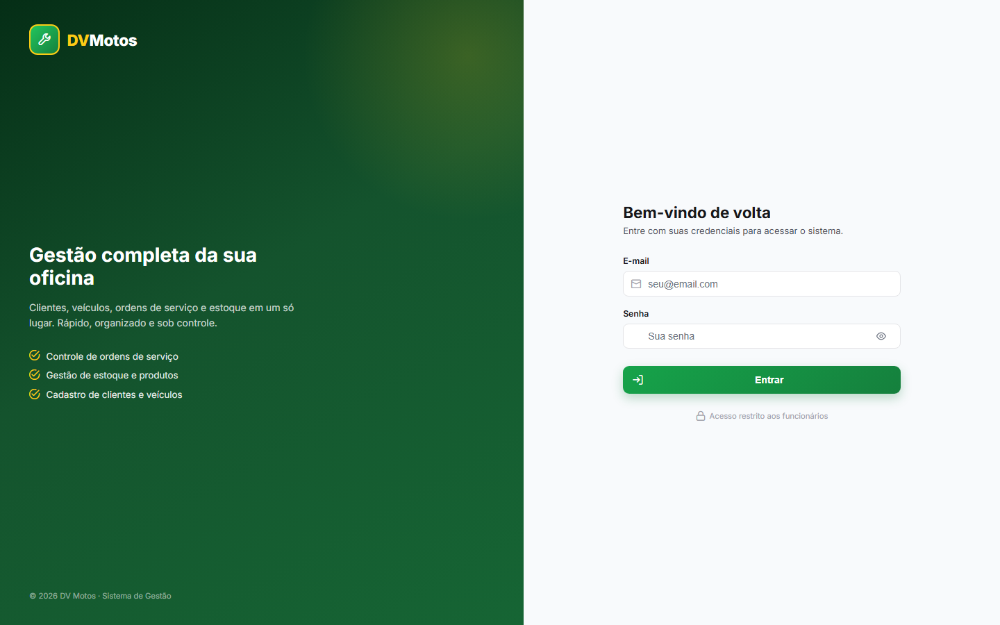
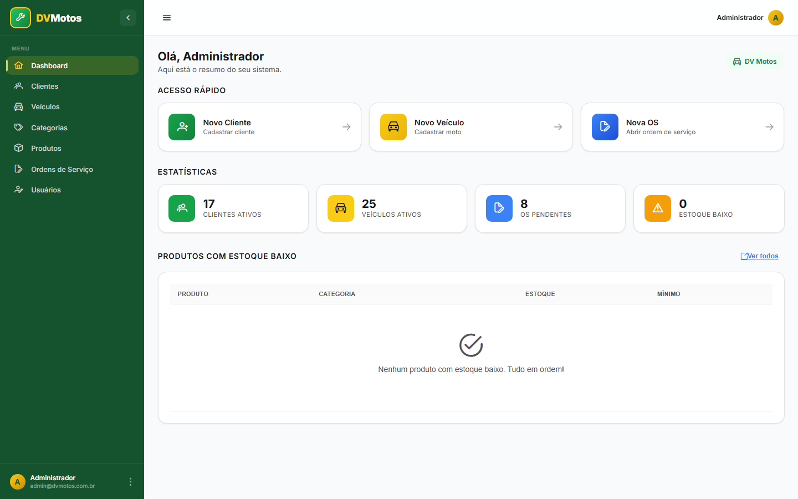
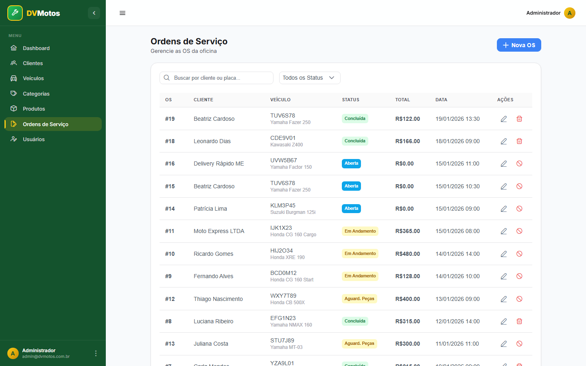
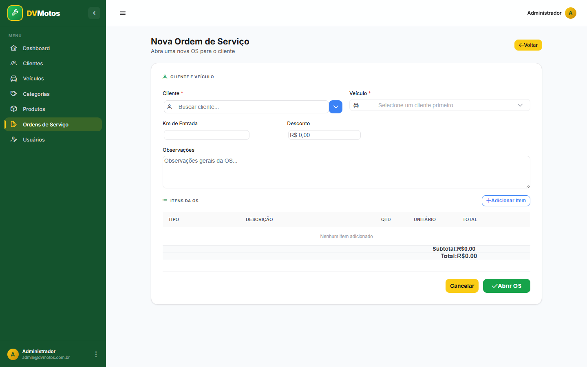
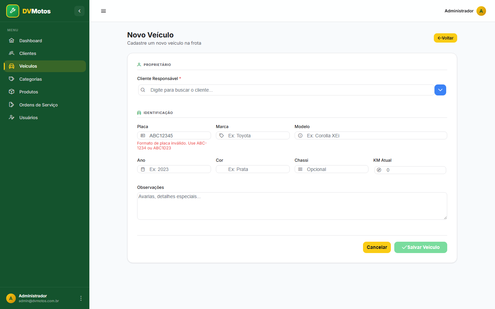

# 🏍️ DV Motos - Sistema de Gestão

**🇧🇷 [Português](#-dv-motos---sistema-de-gestão) | 🇺🇸 [English](#-dv-motos---management-system)**

Sistema de gestão para oficina mecânica de motocicletas.

## 📸 Screenshots

<table>
  <tr>
    <td><br/><sub>Login</sub></td>
    <td><br/><sub>Dashboard</sub></td>
  </tr>
  <tr>
    <td><br/><sub>Ordens de Serviço</sub></td>
    <td><br/><sub>Nova OS</sub></td>
  </tr>
  <tr>
    <td><br/><sub>Cadastro de veículo (validação de placa)</sub></td>
    <td></td>
  </tr>
</table>

## 📋 Funcionalidades do MVP

- ✅ Autenticação com JWT
- ✅ Cadastro de Clientes
- ✅ Cadastro de Veículos
- 🔄 Controle de Estoque (em desenvolvimento)
- 🔄 Ordens de Serviço (em desenvolvimento)
- 🔄 Dashboard com relatórios (em desenvolvimento)

## 🛠️ Stack Tecnológica

### Backend
- Java 21
- Spring Boot 3.2
- Spring Security + JWT
- Spring Data JPA
- PostgreSQL 16
- Flyway (migrations)
- Swagger/OpenAPI

### Frontend
- Angular 17 (Standalone Components)
- PrimeNG 17
- PrimeFlex
- TypeScript

## 🚀 Como Executar

### Pré-requisitos

- Docker e Docker Compose
- Java 21 (para desenvolvimento)
- Node.js 20+ (para desenvolvimento)
- Maven 3.9+ (para desenvolvimento)

### Opção 1: Apenas o Banco de Dados (Desenvolvimento)

```bash
# Subir apenas o PostgreSQL
docker-compose -f docker-compose.dev.yml up -d

# O banco estará disponível em:
# Host: localhost
# Porta: 5432
# Database: dvmotos
# Usuário: dvmotos
# Senha: definida em POSTGRES_PASSWORD no .env

# pgAdmin (opcional) estará em http://localhost:5050
# Email: definido em PGADMIN_EMAIL no .env
# Senha: definida em PGADMIN_PASSWORD no .env
```

### Opção 2: Tudo com Docker

```bash
# Subir todos os serviços
docker-compose up -d

# Frontend: http://localhost:4200
# Backend API: http://localhost:8080/api
# Swagger: http://localhost:8080/api/swagger-ui.html
```

### Opção 3: Desenvolvimento Local

#### Backend

```bash
cd backend

# Instalar dependências e rodar
./mvnw spring-boot:run

# Ou com variáveis de ambiente customizadas
DB_HOST=localhost DB_PORT=5432 ./mvnw spring-boot:run
```

#### Frontend

```bash
cd frontend

# Instalar dependências
npm install

# Rodar em modo desenvolvimento
npm start

# Acessar http://localhost:4200
```

## 🔐 Credenciais Padrão

```
Email: admin@dvmotos.com.br
Senha: admin123
```

## 🧪 Testes E2E (Cypress)

Cobre o ciclo de vida completo de uma Ordem de Serviço: login, seleção de
cliente/veículo (incluindo o carregamento do dropdown de veículo após
selecionar o cliente), adição de itens de serviço e peça, conferência do
total, transição de status (aberta → em andamento → concluída) e o fluxo de
cancelamento com diálogo de confirmação.

O teste roda contra um backend real via API/HTTP — **nunca contra o banco de
desenvolvimento**. Suba um backend isolado com H2 em memória (schema recriado
do zero a cada início, sem afetar o Postgres de dev) em um terminal:

```bash
cd backend
mvn spring-boot:run -Dspring-boot.run.useTestClasspath=true
```

com estas variáveis de ambiente exportadas antes do comando (`export VAR=valor`
no bash, ou `$env:VAR="valor"` no PowerShell):

```
SPRING_DATASOURCE_URL=jdbc:h2:mem:e2edb;DB_CLOSE_DELAY=-1;DB_CLOSE_ON_EXIT=FALSE
SPRING_DATASOURCE_DRIVER_CLASS_NAME=org.h2.Driver
SPRING_DATASOURCE_USERNAME=sa
SPRING_DATASOURCE_PASSWORD=
SPRING_JPA_HIBERNATE_DDL_AUTO=create-drop
SPRING_JPA_PROPERTIES_HIBERNATE_DIALECT=org.hibernate.dialect.H2Dialect
SPRING_FLYWAY_ENABLED=false
JWT_SECRET=qualquer-valor-para-teste-local
ADMIN_EMAIL=test@test.com
ADMIN_PASSWORD=test123
```

`-Dspring-boot.run.useTestClasspath=true` é necessário para o driver do H2
(dependência `test`-scope) ficar disponível em runtime.

Em outro terminal, suba o frontend normalmente (`npm start` dentro de
`frontend/`, servindo em `http://localhost:4200`) e então rode a suíte:

```bash
cd frontend
npm run e2e        # headless, usado em CI
npm run e2e:open   # interativo, com o Test Runner do Cypress
```

Os dados de cliente/veículo usados pelo teste são criados via API com um
sufixo único (timestamp) a cada execução, então a suíte é repetível contra o
mesmo banco H2 aquecido sem precisar de limpeza manual — reiniciar o backend
já reseta tudo, já que o H2 é em memória.

## 📁 Estrutura do Projeto

```
dvmotos/
├── backend/
│   ├── src/main/java/com/dvmotos/
│   │   ├── config/          # Configurações (Security, CORS)
│   │   ├── controller/      # REST Controllers
│   │   ├── dto/             # Data Transfer Objects
│   │   ├── entity/          # Entidades JPA
│   │   ├── exception/       # Exceções customizadas
│   │   ├── repository/      # Interfaces Spring Data
│   │   ├── security/        # JWT e filtros
│   │   └── service/         # Lógica de negócio
│   └── src/main/resources/
│       ├── application.yml  # Configurações
│       └── db/migration/    # Scripts Flyway
│
├── frontend/
│   └── src/app/
│       ├── core/            # Serviços, guards, interceptors
│       ├── shared/          # Componentes compartilhados
│       ├── features/        # Módulos de funcionalidades
│       └── layout/          # Layout principal
│
├── docker-compose.yml       # Produção
└── docker-compose.dev.yml   # Desenvolvimento
```

## 🔌 API Endpoints

### Autenticação
- `POST /api/auth/login` - Login
- `POST /api/auth/refresh` - Renovar token

### Clientes
- `GET /api/clients` - Listar clientes
- `GET /api/clients/{id}` - Buscar por ID
- `POST /api/clients` - Criar cliente
- `PUT /api/clients/{id}` - Atualizar cliente
- `DELETE /api/clients/{id}` - Desativar cliente

### Veículos
- `GET /api/vehicles` - Listar veículos
- `GET /api/vehicles/{id}` - Buscar por ID
- `GET /api/vehicles/license-plate/{placa}` - Buscar por placa
- `GET /api/vehicles/client/{clientId}` - Veículos do cliente
- `POST /api/vehicles` - Criar veículo
- `PUT /api/vehicles/{id}` - Atualizar veículo
- `DELETE /api/vehicles/{id}` - Desativar veículo

## 📝 Variáveis de Ambiente

### Backend

| Variável | Descrição | Padrão |
|----------|-----------|--------|
| `DB_HOST` | Host do PostgreSQL | localhost |
| `DB_PORT` | Porta do PostgreSQL | 5432 |
| `DB_NAME` | Nome do banco | dvmotos |
| `DB_USER` | Usuário do banco | dvmotos |
| `DB_PASSWORD` | Senha do banco | (definida em `.env`) |
| `JWT_SECRET` | Chave secreta JWT | (desenvolvimento) |
| `SERVER_PORT` | Porta da API | 8080 |

## 🤝 Contribuição

1. Fork o projeto
2. Crie uma branch (`git checkout -b feature/nova-funcionalidade`)
3. Commit suas mudanças (`git commit -m 'Adiciona nova funcionalidade'`)
4. Push para a branch (`git push origin feature/nova-funcionalidade`)
5. Abra um Pull Request

---

# 🏍️ DV Motos - Management System

**🇧🇷 [Português](#-dv-motos---sistema-de-gestão) | 🇺🇸 [English](#-dv-motos---management-system)**

Management system for a motorcycle repair shop.

## 📸 Screenshots

<table>
  <tr>
    <td><br/><sub>Login</sub></td>
    <td><br/><sub>Dashboard</sub></td>
  </tr>
  <tr>
    <td><br/><sub>Service Orders</sub></td>
    <td><br/><sub>New Service Order</sub></td>
  </tr>
  <tr>
    <td><br/><sub>Vehicle registration (plate validation)</sub></td>
    <td></td>
  </tr>
</table>

## 📋 MVP Features

- ✅ JWT Authentication
- ✅ Client registration
- ✅ Vehicle registration
- 🔄 Stock control (in development)
- 🔄 Service orders (in development)
- 🔄 Dashboard with reports (in development)

## 🛠️ Tech Stack

### Backend
- Java 21
- Spring Boot 3.2
- Spring Security + JWT
- Spring Data JPA
- PostgreSQL 16
- Flyway (migrations)
- Swagger/OpenAPI

### Frontend
- Angular 17 (Standalone Components)
- PrimeNG 17
- PrimeFlex
- TypeScript

## 🚀 Getting Started

### Prerequisites

- Docker and Docker Compose
- Java 21 (for development)
- Node.js 20+ (for development)
- Maven 3.9+ (for development)

### Option 1: Database Only (Development)

```bash
# Start only PostgreSQL
docker-compose -f docker-compose.dev.yml up -d

# The database will be available at:
# Host: localhost
# Port: 5432
# Database: dvmotos
# User: dvmotos
# Password: set in POSTGRES_PASSWORD in .env

# pgAdmin (optional) will be at http://localhost:5050
# Email: set in PGADMIN_EMAIL in .env
# Password: set in PGADMIN_PASSWORD in .env
```

### Option 2: Everything with Docker

```bash
# Start all services
docker-compose up -d

# Frontend: http://localhost:4200
# Backend API: http://localhost:8080/api
# Swagger: http://localhost:8080/api/swagger-ui.html
```

### Option 3: Local Development

#### Backend

```bash
cd backend

# Install dependencies and run
./mvnw spring-boot:run

# Or with custom environment variables
DB_HOST=localhost DB_PORT=5432 ./mvnw spring-boot:run
```

#### Frontend

```bash
cd frontend

# Install dependencies
npm install

# Run in development mode
npm start

# Access http://localhost:4200
```

## 🔐 Default Credentials

```
Email: admin@dvmotos.com.br
Password: admin123
```

## 🧪 E2E Tests (Cypress)

Covers the full lifecycle of a Service Order: login, client/vehicle selection
(including the vehicle dropdown loading after selecting a client), adding
service and part items, checking the total, status transitions (open → in
progress → completed), and the cancellation flow with a confirmation dialog.

The test runs against a real backend over HTTP — **never against the
development database**. Spin up an isolated backend with an in-memory H2
database (schema recreated from scratch on every start, without touching the
dev Postgres) in one terminal:

```bash
cd backend
mvn spring-boot:run -Dspring-boot.run.useTestClasspath=true
```

with these environment variables exported before the command (`export
VAR=value` in bash, or `$env:VAR="value"` in PowerShell):

```
SPRING_DATASOURCE_URL=jdbc:h2:mem:e2edb;DB_CLOSE_DELAY=-1;DB_CLOSE_ON_EXIT=FALSE
SPRING_DATASOURCE_DRIVER_CLASS_NAME=org.h2.Driver
SPRING_DATASOURCE_USERNAME=sa
SPRING_DATASOURCE_PASSWORD=
SPRING_JPA_HIBERNATE_DDL_AUTO=create-drop
SPRING_JPA_PROPERTIES_HIBERNATE_DIALECT=org.hibernate.dialect.H2Dialect
SPRING_FLYWAY_ENABLED=false
JWT_SECRET=any-value-for-local-testing
ADMIN_EMAIL=test@test.com
ADMIN_PASSWORD=test123
```

`-Dspring-boot.run.useTestClasspath=true` is required so the H2 driver
(a `test`-scoped dependency) is available at runtime.

In another terminal, start the frontend normally (`npm start` inside
`frontend/`, serving at `http://localhost:4200`) and then run the suite:

```bash
cd frontend
npm run e2e        # headless, used in CI
npm run e2e:open   # interactive, with the Cypress Test Runner
```

The client/vehicle data used by the test is created via the API with a
unique suffix (timestamp) on every run, so the suite is repeatable against
the same warm H2 database without manual cleanup — restarting the backend
already resets everything, since H2 is in-memory.

## 📁 Project Structure

```
dvmotos/
├── backend/
│   ├── src/main/java/com/dvmotos/
│   │   ├── config/          # Configuration (Security, CORS)
│   │   ├── controller/      # REST Controllers
│   │   ├── dto/             # Data Transfer Objects
│   │   ├── entity/          # JPA entities
│   │   ├── exception/       # Custom exceptions
│   │   ├── repository/      # Spring Data interfaces
│   │   ├── security/        # JWT and filters
│   │   └── service/         # Business logic
│   └── src/main/resources/
│       ├── application.yml  # Configuration
│       └── db/migration/    # Flyway scripts
│
├── frontend/
│   └── src/app/
│       ├── core/            # Services, guards, interceptors
│       ├── shared/          # Shared components
│       ├── features/        # Feature modules
│       └── layout/          # Main layout
│
├── docker-compose.yml       # Production
└── docker-compose.dev.yml   # Development
```

## 🔌 API Endpoints

### Authentication
- `POST /api/auth/login` - Login
- `POST /api/auth/refresh` - Refresh token

### Clients
- `GET /api/clients` - List clients
- `GET /api/clients/{id}` - Find by ID
- `POST /api/clients` - Create client
- `PUT /api/clients/{id}` - Update client
- `DELETE /api/clients/{id}` - Deactivate client

### Vehicles
- `GET /api/vehicles` - List vehicles
- `GET /api/vehicles/{id}` - Find by ID
- `GET /api/vehicles/license-plate/{plate}` - Find by license plate
- `GET /api/vehicles/client/{clientId}` - Vehicles owned by a client
- `POST /api/vehicles` - Create vehicle
- `PUT /api/vehicles/{id}` - Update vehicle
- `DELETE /api/vehicles/{id}` - Deactivate vehicle

## 📝 Environment Variables

### Backend

| Variable | Description | Default |
|----------|--------------|---------|
| `DB_HOST` | PostgreSQL host | localhost |
| `DB_PORT` | PostgreSQL port | 5432 |
| `DB_NAME` | Database name | dvmotos |
| `DB_USER` | Database user | dvmotos |
| `DB_PASSWORD` | Database password | (set in `.env`) |
| `JWT_SECRET` | JWT secret key | (development) |
| `SERVER_PORT` | API port | 8080 |

## 🤝 Contributing

1. Fork the project
2. Create a branch (`git checkout -b feature/new-feature`)
3. Commit your changes (`git commit -m 'Add new feature'`)
4. Push to the branch (`git push origin feature/new-feature`)
5. Open a Pull Request
